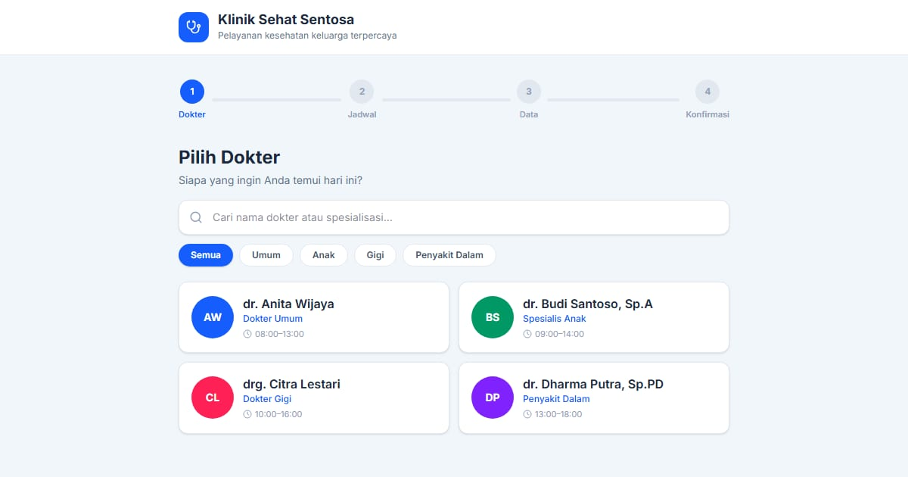

# Klinik Rumpun Waras — Buat janji temu dokter

Klinik keluarga (fiktif). Paradigma **slot penyedia**: pilih dokter, lalu tanggal pada hari praktiknya dan slot 30 menit yang masih kosong.

**Demo live:** https://reservasi-klinik-rose.vercel.app



> Purwarupa desain. Nama usaha, data, dan harga fiktif. Tidak ada pembayaran dan tidak ada yang dikirim ke server: pemesanan disimpan di `localStorage` peramban. Tanggal dan jam dihitung dalam WIB di peramban; keterisian contoh dibuat stabil per tanggal.

## Fitur

- Tiap dokter punya hari praktik mingguan; tanggal tanpa praktik tidak muncul.
- Nomor urut perkiraan, jenis pasien, dan cara bayar; peringatan gawat darurat (112) di atas formulir.
- `/dokter` — tabel jadwal mingguan dan persiapan sebelum datang per dokter.
- `/janji` — janji saya dengan daftar persiapan sesuai dokter.

## Halaman

`/` · `/dokter` · `/janji`

## Teknologi

- Next.js 15.5 (App Router) dan React 19
- Tailwind CSS v4
- JavaScript
- Framer Motion, Lucide (ikon)
- Font: Inter (next/font)
- SEO: metadata per halaman, Open Graph, sitemap.xml, dan robots.txt

## Menjalankan secara lokal

```bash
npm install
npm run dev
```

Buka http://localhost:3000. Untuk build produksi: `npm run build` lalu `npm start`.

---

Bagian dari koleksi 5 aplikasi reservasi di [PortalReservasi](https://www.pintuweb.com/website-reservasi). Dibuat oleh [PintuWeb](https://www.pintuweb.com), jasa pembuatan website.
